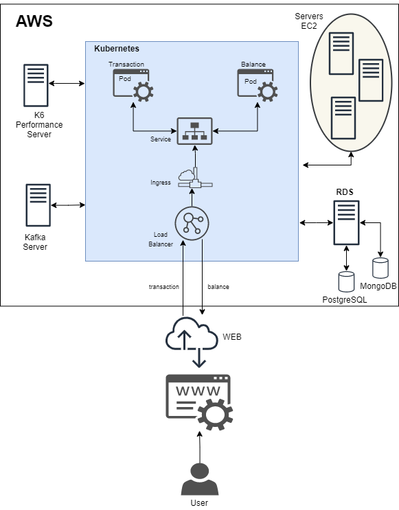

# cqrs-quarkus-kafka-udinei

Implantação de uma aplicação desenvolvida com o framework Quarkus, localmente usando docker, e na nuvem usando o serviço Elastic Kubernetes Service da Amazon. A aplicação é um exemplo do padrão CQRS que contempla dois serviços Quarkus escritos em Kotlin que se comunicam através de um barramento assíncrono usando o Kafka, armazenando dados nos Banco Postgres e MongoDB. Com a criação dos manifestos do Kubernetes para implantação no EKS e configurações necessárias para ter o ambiente rodando em produção na AWS.

# Arquitetura da aplicação (Cloud)

# Stack
- Quarkus
- Java 15
- Kotlin 1.3.61
- Docker v19.03.8
- Docker compose
- Kafka 2.4.0
- mongoDB
- PostgreSQL
- Zookeeper
- Gradle 6.8

# Requisitos

- Conta na AWS
  - Criar instâncias
     - kubernetes (RDS)
     - K6PerformanceServer (EC2)
     - kafkaServer (EC2)
       - zookeeper (Container Docker)
       - kafka (Container Docker)
     - 3 instâncias EC2 (Nodes para Kubernetes)

# Estrutura do projeto
- balance-service
- images
- performance-tests
- transaction-service
 
# Atualizando as dependências do projeto
<pre>gradle dependencies</pre>

# Build da aplicação
Na pasta do serviço transaction-service execute:
<pre>gradle clean build -x test</pre>

### Atualizando pacotes
<pre>gradle -Pnative -Dquarkus.native.container-build=true</pre>

### Gerando Build Native da aplicação
Já vem com a GraalVM, que roda sem a necessidade da JVM java

<pre>gradle buildNative --docker-build=true</pre>

# Subindo a infra Local (containers Docker) 
Na pasta do projeto executar:
<pre> docker-compose up --build -d</pre>

Com a execução do arquivo docker-compose.yml os seguintes container Docker serão criados:
- bankaccount-kafka (Broker)
- bankaccount-zookeeper (Monitor de mensagens kafka)
- bankaccount-postgres (BD OR)
- bankaccount-mongo (BD NoSQL)

# Criando um tópico no cluster kafka
<pre>docker exec -it bankaccount-kafka ./bin/kafka-topics.sh --create --topic transactions --zookeeper bankaccount-zookeeper:2181 --replication-factor 1 --partitions 1</pre>

No windows use:
<pre>winpty docker exec -it bankaccount-kafka ./bin/kafka-topics.sh --create --topic transactions --zookeeper bankaccount-zookeeper:2181 --replication-factor 1 --partitions 1</pre>

# Testando a aplicação
<b>Pré-condição: </b>
- Infra em execução (Containers Docker)
- Serviços Quarkus Transaction e Balance em execução

Na pasta do projeto, executar:

### Inserindo transação de Receitas
Um CURL e enviando um request para criar uma transação de "Receita" (Income)
<pre>curl -X POST -H "Content-Type: application/json" -d @income-transaction.json http://localhost:8080/transactions</pre>

### Inserindo transação de Despesas
E um CURL enviando um request para criar uma transação de "Despesas" (Expense)
<pre>curl -X POST -H "Content-Type: application/json" -d @expense-transaction.json http://localhost:8080/transactions</pre>

# Inserindo o tópico  "transaction" no kafka
<pre>docker exec -it bankaccount-kafka ./bin/kafka-topics.sh --create --topic transactions --zookeeper bankaccount-zookeeper:2181 --replication-factor 1 --partitions 1</pre>

# Verificando o resultado da transação
Solicitação CURL para buscar o resultado da transacao (balance)
para tanto a aplicação transation-balance tem que estar rodando

<pre>curl http://localhost:8081/balance\?accountId\=wesley | json_pp</pre>

# Help Docker

Subir a infra da aplicação utilizando docker-compose e Liberando o terminal
<pre>docker-compose up --build -d </pre>

Parar e remover toda a infra do docker
<pre>docker-compose down </pre>

Visualizando todos os container rodando no docker
<pre>docker ps </pre>

### Acessando BD postgres no container Docker Postgres via PSQL
<code>docker exec -it <imageDocker> psql -U <userBD> <Bd></code>

<pre>docker exec -it postgres psql -U postgres postgres</pre>

### Acessando diretamente o schema do BD via Docker
docker exec -e "PGOPTIONS=--search_path=<your_schema>" -it docker_pg psql -U user db_name

# HELP Postgres (psql) 

### Visualizando schemas do BD
<pre>SHOW search_path;</pre>

### Mudando de schema
<pre>SET search_path TO myschema</pre>

### Acessando banco de dados postgres local via PSQL
<pre>psql -h localhost -p 5432 -U postgres postgres</pre>

### Listando schemas do BD
<pre>porstgres#\dn - list of schemas</pre>

### Listando todas as base de dados
<pre>postgres# \l</pre>

### Altenando entre banco de dados
<pre>postgres# \c nomeBanco user</pre>

### Listando tabelas do BD
<pre>posgtres# \dt</pre>

# Help MongoDB
### Acessando o Container do mongoDB
No terminal executar:

Linux:
<pre>docker exec -it bankaccount-mongo bash</pre>
Windows:
<pre>winpty docker exec -it bankaccount-mongo bash</pre>

### Conectando o cliente mongo ao servidor MongoDB
<pre>mongo -u usuário-da-base -p senha-da-base host-de-conexao/nome-da-base</pre>

### Exibindo banco de dados no mongo
<pre>show database</pre>

### Mudando de banco
<pre>use bankaccount</pre>

### Visualizando as collections do banco
<pre>show collections</pre>

### Consultando collections do BD
<pre>db.balances.find()</pre>

# Referências
* [Projeto Live Labs Wesley Fuchter](https://github.com/wesleyfuchter/cqrs-quarkus-kafka)
* [RedHat Quarkus](https://www.redhat.com/pt-br/topics/cloud-native-apps/what-is-quarkus)
* [Introdução ao Quarkus](https://www.infoq.com/br/articles/getting-started-with-quarkus/)
* [Comandos PSQL](https://pt.wikibooks.org/wiki/PostgreSQL_Pr%C3%A1tico/Ferramentas/psql)
* [Postgres](https://www.postgresql.org/)
* [Tutorial Mongo](https://www.luiztools.com.br/post/tutorial-mongodb-para-iniciantes-em-nosql-2/)
* [Flyway](https://quarkus.io/guides/flyway)
* [kafka](https://kafka.apache.org/quickstart)

